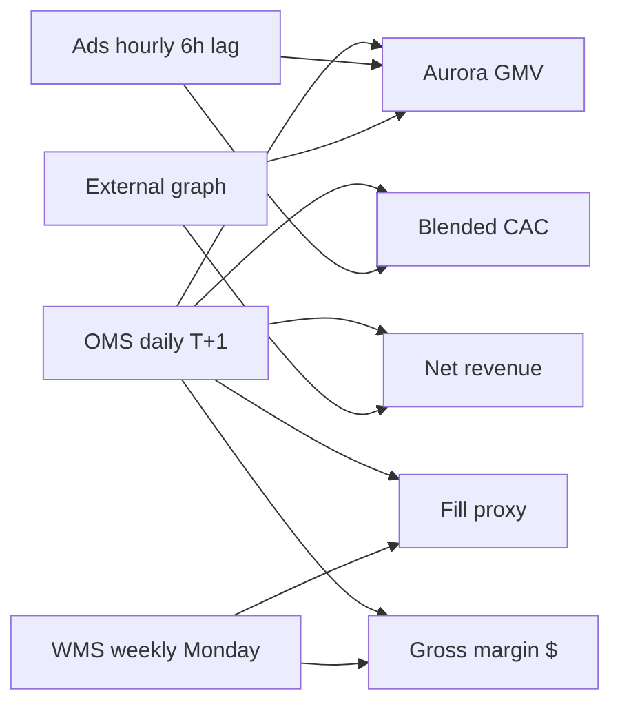
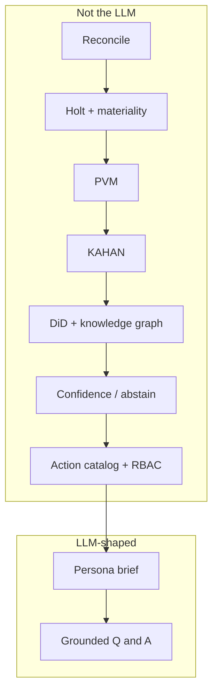

# BusinessIntelligence.ai

### From KPI movement to owned action

**Accenture Innovation Challenge 2026 · Round 2**  
**Team Lithub · IIT Patna**  
Garvit Sahni (Lead) · Pranav Gupta · Jatin Aggarwal

> Businesses do not need more dashboards. They need **business reasoning** — a close they can defend, an owner for the next lever, and the honesty to abstain when the sources fight.

This repository is the **working Round 2 prototype**: a KPI intelligence-to-action engine. It is not a slide deck with screenshots. Open it, switch seats, and walk four live scenarios on one weekly close.

The language model is **never** the source of quantitative truth. Every dollar, z-score, contribution, and confidence band is computed **before** a sentence is written.

---

## 1. The problem we are solving

Operators already have Tableau, Looker, and a lakehouse. What they still do on Sunday night is:

- reconstruct a KPI movement across systems that do not share a grain or a calendar
- argue whether “customer” means a first-party new buyer or a 7-day-click conversion
- annualize a launch with eighteen days of history
- pay to acquire demand a warehouse cannot ship
- brief three leaders with three different stories from the same week

The costly failure is not a missing chart. It is a **confident story built on the wrong close**.

Round 1 named the gap. Round 2 adds the constraints that make reasoning real: heterogeneous refresh, sparse history, contradictory evidence, decision rights, row/column security, feedback, and the bill for every model call.

---

## 2. What BI.ai is

An **analyst loop that runs as software**.

Same order as our Round 1 solution:

```
Holt forecast  →  detect material movement
KAHAN          →  attribute the parent miss down the tree
Causal DiD     →  separate common shocks from treated ones
Knowledge graph→  join events, levers, owners
Evidence gate  →  abstain or cap confidence
Action catalog →  lever → owner → monitor
Storytelling   →  persona brief over a frozen pack
Feedback       →  reweight drivers, reroute owners
```

Around that loop we added Round 2 governance: ISO-week reconcile across daily / hourly / weekly sources, a semantic contract, RBAC before the prompt, and runtime telemetry.

**Illustrative world.** Fictional omnichannel brand **Northline**. Close: **ISO 2026-W34** (17–23 Aug) vs **W33**. Data is seeded and reproducible — not a customer extract, not a hardcoded JSON story.

---

## 3. Run it in two minutes

Node.js 18+ and npm. **No API keys. No `.env`.**

```bash
npm install
npm run dev
```

Open **http://localhost:4731**

| Command | Purpose |
| --- | --- |
| `npm run dev` | Dev server on port **4731** |
| `npm test` | Engine assertions (PVM identity, abstain, sparse cap, RBAC, learning) |
| `npm run verify` | Print the computed W34 close |
| `npm run build` | Production build |
| `npm run start` | Serve the production build |

---

## 4. Seven-minute judge path

Start as **CFO** (Priya Shah). The header already shows latency, model calls, and estimated $.

| Step | Go here | What you should see |
| --- | --- | --- |
| 1 | `/` | Four tiles. Revenue **$445k (−6.8%)**. Switch **CFO → Category → Growth**. Growth: margin **Denied**. |
| 2 | `/insight/net-revenue-w34` | Multi-factor miss. Holt residual. PVM +$8k / −$11k / −$29k. KAHAN: West hoodie **−$53k**. DiD vs Central+East. Owned actions. Ask *Why did this move?* |
| 3 | `/insight/blended-cac-conflict` | **Abstain.** First-party CAC $93→$117; platform CAC moved the other way. Engine asks which definition is binding. |
| 4 | `/insight/aurora-pulse-sparse` | New SKU, 18 days, confidence **capped at 44%**. Hold launch media. |
| 5 | `/insight/fill-rate-reno` as **Growth** | Official WMS stale. `vendorExpediteCost` = **REDACTED**. |
| 6 | `/semantics` · `/architecture` · `/telemetry` | Contract, LLM vs not, cents per brief. |
| 7 | Confirm a driver → `/feedback` | Weight changes. The ranker re-runs. That is the learning loop. |

A spoken teleprompter lives in [`docs/DEMO.md`](docs/DEMO.md).

---

## 5. Round 2 minimums — all met, all live

| Requirement | Where it lives | Proof on this close |
| --- | --- | --- |
| 3–5 connected KPIs, 2–3 sources, different grains / cadences | `/semantics` | **Five** KPIs. **OMS daily T+1**, **ads hourly (~6h lag)**, **WMS weekly Monday**. |
| Semantic contract (definitions, calc, drivers, thresholds, lineage, access) | `/semantics`, `lib/semantics.ts` | Formula, grain, calendar, floors, lineage, CFO/Category/Growth access on every KPI. |
| ≥2 personas, different narratives / actions | Header switcher | Three seats. Different copy, denied fields, and owned levers. |
| Multi-factor movement with known / simulated drivers | `/insight/net-revenue-w34` | Price, volume, mix, West hoodie, Summit Days, Reno inbound. |
| Low-confidence abstention / clarification | `/insight/blended-cac-conflict` | Contradictory conversion definitions. Status **abstain**. |
| Sparse / newly launched KPI | `/insight/aurora-pulse-sparse` | Aurora Pulse, launch 5 Aug, 18 selling days. |
| Role-based entitlement | `/insight/fill-rate-reno` as Growth | Unit COGS and expedite cost masked **before** narrative. |
| Evidence: freshness, method, contribution, confidence, lineage | Every insight table | Source age, method id, dollars, lineage path; confidence on the brief. |
| Clear LLM vs non-LLM breakdown | `/architecture` | Table of this run, stage by stage. |
| Runtime telemetry (latency, calls, tokens, estimated cost) | Header + `/telemetry` | ~30–40 ms · 12 calls · ~2.5k tokens · **~$0.0009**. |

---

## 6. Connected KPIs and heterogeneous sources

| KPI | Formula (contract) | Sources | Grain / freshness |
| --- | --- | --- | --- |
| Net revenue | Σ qty × net unit price on ship-confirm | OMS | Day / SKU / region / channel · T+1 06:00 UTC |
| Gross margin $ | Revenue − qty × latest weekly unit COGS | OMS + WMS | Daily facts, **weekly COGS forward-filled** |
| Blended CAC | Paid spend / first-party new customers | Ads + OMS | Hourly ads, ~6h lag, rolled to ISO week |
| Aurora Pulse GMV | Revenue of `aurora-pulse` only | OMS + ads | Launch 2026-08-05 · no YoY |
| On-time fill | Official WMS weekly; OMS `fulfilled_on_time` proxy | WMS + OMS | Official lands **Monday**; W34 official is **missing** |

They are linked on purpose: revenue is constrained by fill, CAC funds revenue and Aurora, margin inherits mix and COGS grain.



---

## 7. Personas and decision rights

| Seat | Name | What they own | What they must not see |
| --- | --- | --- | --- |
| **CFO** | Priya Shah | Materiality, cash gates (expedite > $25k), board language, explicit non-claims | — |
| **Category** | Marcus Chen | Regional AUR tests, promo depth, merchandising, inbound priority | Fully loaded CAC, overhead |
| **Growth** | Aisha Rahman | Paid allocation **after** definitions agree; suppress ads we cannot fill | Unit COGS, vendor expedite cost, margin by vendor |

Masking happens in `lib/security.ts` **before** the narrative pack is built. Denied fields never enter the prompt. Growth asking “show me secret COGS” is **refused**.

---

## 8. The four scenarios (this close)

### Multi-factor revenue — `/insight/net-revenue-w34`

- **−$32k (−6.8%)** vs W33. Material on economic floor, z ≈ 2.0, and composition (West hoodie hole).
- **PVM (identity):** price **+$8k** (Apparel +4.2% AUR test), volume **−$11k**, mix **−$29k** (clearance tees). Residual ≈ $0.
- **KAHAN:** largest child is **West × Core Hoodie (~−$53k)**.
- **DiD:** West hoodie vs Central+East hoodie. National AUR is the **common shock**, so the ATT is competition + fill, not price.
- **Graph:** Summit Days (West) → hoodie → pause-West-AUR / expedite / clearance levers → owners.
- **Actions:** pause West AUR test · contingent Reno expedite · tighten clearance · West bundle (not a national price war).

### Abstention — `/insight/blended-cac-conflict`

- Spend **$103k → $124k**. First-party new customers down. Platform conversions **up**.
- Blended CAC **$93 → $117**. Platform CAC moved **the other way**.
- Status **abstain** (confidence 28%). The engine **asks** which conversion definition is binding for W35.
- Action: **do not reallocate** paid. Aurora launch budget stays ring-fenced.

This is the product’s integrity test. A dashboard would show one CAC. We refuse to invent a blended compromise.

### Sparse launch — `/insight/aurora-pulse-sparse`

- GMV **+$37k (+25%)** on **18 selling days**.
- Confidence **capped at 44%**. Status **sparse**. Not material as a run-rate.
- Analog (2025 Pulse Lite) is labeled **analog**, not a causal control.
- Action: **protect launch media**. Do not raid it to backfill hoodie demand.

### Fill + entitlement — `/insight/fill-rate-reno`

- Official WMS W34 **has not landed** (last snapshot Monday 18 Aug = W33).
- OMS proxy: West hoodie on-time fill **~95% → ~61%**.
- Reno on-hand thin; inbound dated 29 Aug.
- CFO sees expedite cost and the $25k gate. **Growth sees REDACTED.**

---

## 9. Methods — who is allowed to do which job

| Stage | Kind | Why this, not an LLM |
| --- | --- | --- |
| Ingest + ISO-week reconcile | Deterministic | Grains and late facts cannot be negotiated in prose |
| Holt linear forecast | Statistical | Detection is residual vs an 80% interval |
| Materiality | Stats + rules | z-score **and** $ / % floors **and** child composition |
| Price–volume–mix | Statistical identity | Must add up. Residual is a check, not a story |
| KAHAN hierarchy | Statistical + graph | Parent miss must name the child; graph-linked nodes are boosted |
| Difference-in-differences | Causal | Isolates West from a control that shared the national price test |
| Knowledge-graph walk | Deterministic retrieval | Summit Days and decision rights are not in the order fact table |
| Driver score | Rules | \|contribution\| × support × freshness × **feedback weight** |
| Abstention / sparse cap | Rules | Contradiction → abstain. History < 28 days → cap confidence |
| Action catalog | Business rules | lever → expected impact → owner → decision rights → monitor |
| RBAC | Rules | Mask before prompt |
| Persona narrative + Q&A | LLM-shaped | Voice and structure only. Numbers are passed in as JSON |

In this prototype the composer is **deterministic** so the demo never depends on a vendor key. `/telemetry` still estimates tokens and $ at **gpt-4o-mini list** ($0.15 / $0.60 per 1M). Production would swap the composer for a small hosted model **without changing a single computed field**.



---

## 10. What is computed vs what is designed

**Computed on every run** (`lib/engine/pipeline.ts`):

- weekly rollups, Holt forecast, materiality, PVM identity, KAHAN tree, DiD ATT, driver ranking, action match, narratives from those numbers, token/cost math

**Designed so judges can walk four tests in one close:**

- Northline shocks in `lib/data/generate.ts` (West hoodie cut, AUR test, clearance mix, spend up, two CAC series, WMS W34 null)
- which drivers attach to which insight
- the graph’s nodes and edges
- the action catalog and decision rights

`npm test` asserts PVM adds back to Δ revenue, rejecting a driver **lowers its weight**, Growth does not receive margin evidence, CAC is **abstain**, Aurora is **sparse**, official W34 fill is **null**.

Change the shocks; the dollars move. This is a prototype, not a painted demo.

---

## 11. Learning loop

On any insight:

- **Confirm driver** → weight × 1.12 (cap 1.35)
- **Reject / downweight** → weight × 0.70 (floor 0.25)
- **Wrong owner** → cycle CFO → Category → Growth

Stored in `localStorage`. `/feedback` shows the log. Nothing here fine-tunes a foundation model. Production would promote weights behind change control.

---

## 12. Economics, security, scale

This close: **tens of milliseconds**, **12** narrative-shaped calls, **~$0.0009**.

A wrong weekly media shift on contested CAC, at this illustrated scale, is **five figures**. Advertising an unfilled hero SKU wastes the same. Judging a wearable on 18 days is a strategy error.

We cache the evidence pack. We write voice last. We treat **abstention as a cost control** — we do not spend tokens arguing a definition war. Denied columns never enter context.

**Native vs custom.** Warehouse jobs and identity would be *configured* (Databricks / Fabric / Snowflake + IdP). The reasoning plane — abstention, decision rights, evidence-locked narrative — stays **custom**, because no dashboard product currently owns that contract.

---

## 13. Business case, roadmap, risks

**Users:** CFO / FP&A, category leads, growth. Secondary: platform owners and auditors.

**Return:** hours of analyst reconstruction and one avoided bad meeting per close. Token cost is not the bill. The bad meeting is.

**Roadmap**

1. **Pilot close** — five KPIs, three sources, three seats *(this repo)*.
2. **Governed production** — warehouse jobs, IdP RLS, labeled-week evaluation set.
3. **Richer priors** — hierarchical forecasts; DiD on more regional tests.
4. **Action fabric** — tickets in the systems owners already use; monitors that close themselves.

**Risks**

| Risk | Mitigation in this prototype |
| --- | --- |
| Hallucinated numbers | LLM never originates quantities; Q&A refuses out-of-pack asks |
| Definition drift | Official vs proxy is first-class; contradiction → abstain |
| Sparse history | Confidence cap; no annualization |
| Entitlement leak | Mask before prompt |
| Token cost | Small-model rates, cached evidence |
| Feedback poisoning | Visible, resettable weights |

---

## 14. Repository map

```
app/                  Briefing, insights, semantics, methods, telemetry, feedback
app/api/brief/        JSON brief (?persona=cfo|category|growth)
lib/engine/           forecast · kahan · causal · PVM · materiality · drivers · actions · narrative · pipeline
lib/data/generate.ts  Seeded Northline facts
lib/semantics.ts      KPI contract + action catalog
lib/knowledge-graph.ts
lib/security.ts       Column / domain mask
lib/feedback.ts       Learning loop
lib/personas.ts
docs/DEMO.md          Spoken 7-minute path
docs/BUSINESS_PROPOSAL.md
scripts/              engine.test.ts · verify-engine.ts
```

**Stack:** Next.js 15 (App Router), TypeScript, Tailwind, Recharts. Reasoning is TypeScript application code.

---

## 15. Why this should win

Most “AI analyst” demos are a chart, a prompt, and a paragraph. Judges can smell that in thirty seconds.

Lithub is different because it **refuses** in public:

- it will not brief a single CAC when two systems disagree
- it will not annualize eighteen days
- it will not show Growth the expedite invoice
- it will not let the model invent a dollar
- it will show you the **method, the age of the source, the residual, and the owner**

That is business reasoning. That is Round 1, still running. That is Round 2, actually built.

Northline figures are illustrative. They are not a customer dataset.
